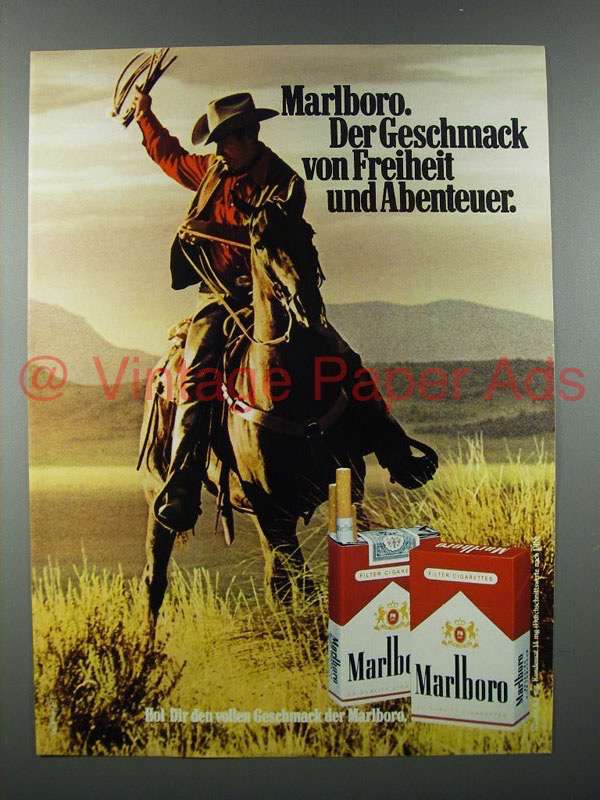

# Advertisement Analysis Activity 

## General Information 

- Due 4/25/2025
- 5 points possible. 
  
## Instructions: 

Select an advertisement to analyze. This can be an advertisement such as one you might see on YouTube or on television, an image like what you might see in a magazine, or an advertisement from an internet shopping website or social media. Save a link, screenshot, or picture of the advertisement, and paste it into your document.

1. Briefly describe the advertisement.

### Respond to the following:

1. Name any relevant characteristics of the SOURCE (e.g., credibility [expertise and trustworthiness], appearance of credibility, attractiveness, similarity to the audience) that may impact persuasion. How does the characteristic(s) tend to impact persuasion?
2. Name any relevant characteristics of the MESSAGE (e.g., argument strength, vivid instances vs. statistical trends, linking the product or service to positive stimuli, promoting positive or negative mood) that may impact persuasion. How does the characteristic(s) tend to impact persuasion?
3. What type of AUDIENCE (e.g., folks high in need for cognition, those high in self-monitoring, folks with initial attitudes for or against the product) does the advertisement seem to be aimed toward? Why do you think so?
4. Given your analysis, does the advertisement consist more of a central or peripheral route argument?

---

# Assignment Submission:  

image:

A full-page print ad shows a lone cowboy, mid-ride, horse rearing against a sweeping Western landscape. At the bottom-right, two Malboro cigarette packs sit beside the copy: "Come to where the flavor is. Come to Malboro Country."

1. Source Characteristics:
    1. Credibility / Experise. The cowboy is not a smoking expert but his rugged competence with ranch gear implicitly signals experiential know-hopw and authencitiy. It is perceived competence which can substite for true expertise, boosting trust in low-involvement.
    2. Trustworthiness. Unscrpted, gritty scene. Ads that look canddid often reduce resistance and raise acceptance.
    3. Attractiveness. He is a physiclaly fit man. Attractive individuals increase liking of the product.
    4. Similarity. It embodies traditional US masculine ideals, and can cause similairty perceivance which heightens persuasion by lowering counter-arguing. 
       
2. Message Characterisitics:
    1. Simple. Vivid. One striking visual and minimal text. It causes vivid concrete images that are processed quickly and are memorable.
    2. Positive affective association. It links smoking to freedom, adventure, wide open spaces. Classical condiiton logic would pair these two together.
    3. Slogan involves flavor. It implies sensory reward. Weak factual context which taps heuristics like "good tasts".
    4. Symbolic framing. Malboro country frames brands as a lifestyle or a community which creates an identity based motivation for buying it. 
       
3. Intended Audience:
    1. Low-to-moderate need for congition. There are sparse facts, there is heavy imnagery, and it suggests the ad does not expect analytical scrutiniy.
    2. High self monitoring individeuals: It offers ready made masculine persona to adopt for sale.
    3. Consumers with neutral or slight resistance to smoking: it doesn't address health claims, it focuses on lifestyle, and focuses on flavor.

4. Central vs Peripheral Route:

The ad leans heavily on the peripheral route. It has an attractive source, evocative scenery, aspirational identities, and a feel good lsogan. It provides virtually no hard evidence. Under the Elaboration Likelihood Model it thus operates primarily though the peripheral route. 
    
